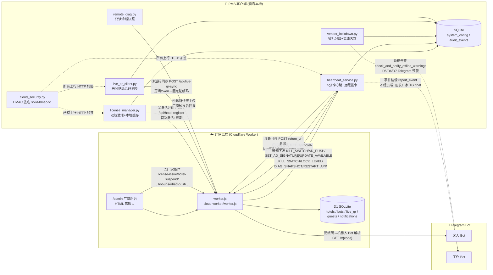
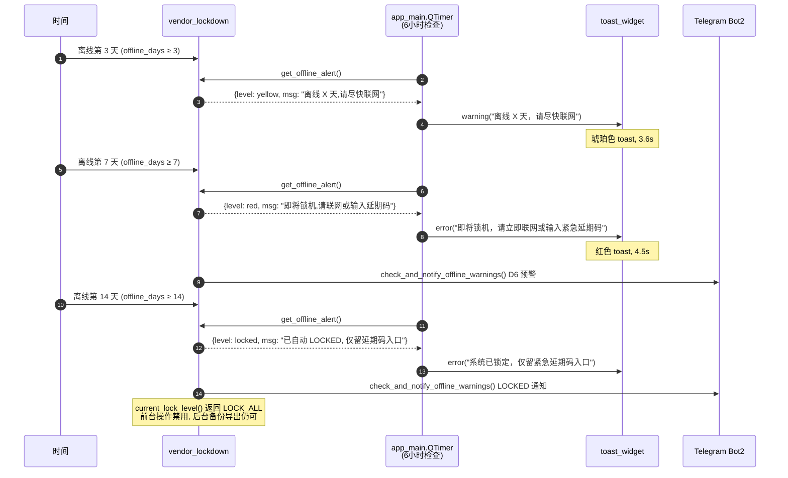
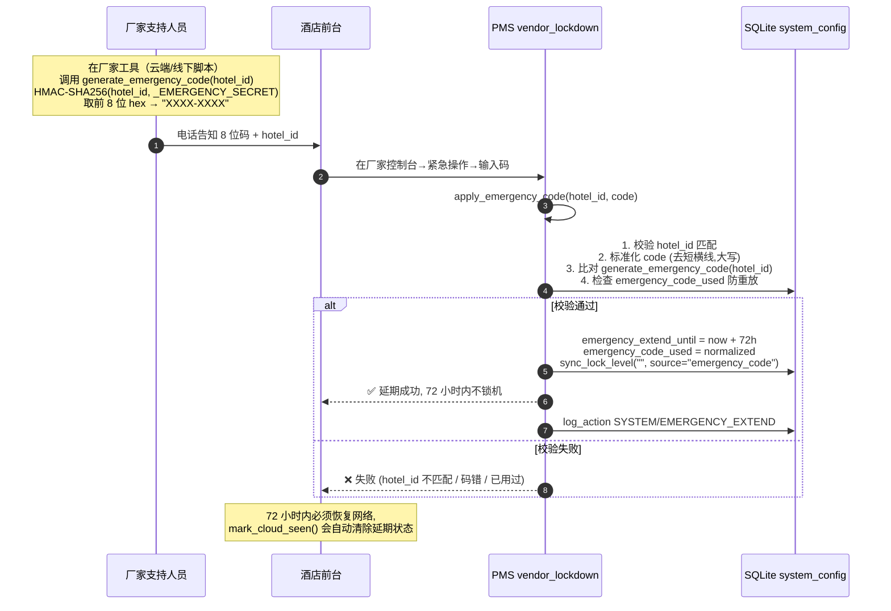

# 厂家云端控制体系 — 完整架构文档

> **目标读者**：新工程师、厂家支持人员、运维审计员
> **目标**：本文档让你 10 分钟读懂厂家怎么控制 PMS，无需翻阅 13 个零散模块。
> **维护人**：厂家云端体系梳理员（sub-h）
> **最后修订**：2026-06-22

---

## 0. 一句话总览

> PMS = 酒店端运行的本机系统；厂家云端 = Cloudflare Worker（cloud-worker/worker.js）。
> 厂家通过 **5 条通道** 控制 PMS：许可证校验、心跳轮询、活码同步、远程指令、远程诊断。
> 全部通道受 `solid-hmac-v1` HMAC 签名保护；离线时按 D3/D7/D14 三级阶梯降级告警与锁机。

---

## 1. 控制链路全景图



### 1.1 通道明细表

| # | 通道名 | 方向 | 协议 | 签名 | 触发时机 | 用途 | 模块 |
|---|---|---|---|---|---|---|---|
| ① | 心跳轮询 | PMS→Cloud→PMS | HTTPS GET `/api/hotel-poll?hotel_id=HT_xxx` | HMAC solid-hmac-v1（心跳体） | 后台线程每 5 分钟一次（`HeartbeatService`） | 上报在线状态 + 拉取通知 + 处理远程指令 + 写 `last_cloud_seen_at` | `heartbeat_service.py`, `manufacturer_comm.py` |
| ② | 激活注册 | PMS→Cloud→PMS | HTTPS POST `/api/hotel-register` | HMAC + 本地 SHA-256 双轨 | 首次激活 / 续期 / `LicenseManager.verify_cloud()` | 注册酒店、下发 `kill_date`、确认 `status=ACTIVE` | `license_manager.py`, `vendor_activation_screen.py` |
| ③ | 活码同步 | PMS→Cloud→PMS | HTTPS POST `/api/live-qr-sync` | HMAC solid-hmac-v1 | 房间 token 变更 / 退房换令牌 / 手动同步 | 房间贴纸不变（`/r/{8位code}` 印一次），扫码跳云端查绑定机器人 | `live_qr_client.py`, `qr_code_service.py` |
| ④ | 远程诊断 | Cloud→PMS→Cloud | 心跳内嵌 `DIAG_SNAPSHOT` 指令 + POST `return_url` | HMAC（心跳体）+ `return_url` 无签名（HTTPS only） | 厂家在管理后台发指令 / 厂家支持工单触发 | 上传只读快照（logs/DB 状态/适配器/资源），不读客人身份证、不改账本 | `remote_diag.py`, `heartbeat_service._upload_diag_snapshot()` |
| ⑤ | 厂家管理 | Admin→Cloud | HTTPS（HTML 后台 + JSON API） | `?pwd=adminPwd` URL 参数（弱但 Cloudflare 边缘 HTTPS） | 厂家在 `/admin` 页面操作 | 授权下发、酒店停用恢复、Bot 增改、广告推送、签名下发、活码列表查看、客人广播 | `manufacturer_comm.py`, cloud-worker `/admin` |

### 1.2 Telegram 旁路通道（不经云端）

| 方向 | 触发 | 用途 | 模块 |
|---|---|---|---|
| PMS→Bot2→厂家 chat | `ManufacturerCommService.report_event(event_type, details)` | 关键事件镜像（锁机、激活、异常）静默上报 | `manufacturer_comm.py` |
| PMS→Bot2→厂家 chat | `vendor_lockdown.check_and_notify_offline_warnings()` | D5/D6/D7 阶梯预警（每阶段发一次） | `vendor_lockdown.py`, `telegram_notify.py` |
| PMS→Bot1→客人 chat | 客人订单/查询 | 客房服务对话 | `telegram_handlers.py`, `telegram_shadow.py` |

---

## 2. 五大控制能力矩阵

| # | 能力 | 模块 | 触发 | 作用 | 离线表现 |
|---|---|---|---|---|---|
| 1 | **锁机分级** | `vendor_lockdown.py` | 云端下发 `LOCK_LEVEL` 指令 / 离线天数阶梯 | NORMAL / WARN_BANNER / LOCK_GUEST_BOT / LOCK_REPORTS / LOCK_ALL 五级；LOCK_ALL 时禁用关键功能但允许备份导出 | 离线时按 D3 黄色告警 / D7 红色弹窗 / D14 自动 LOCKED |
| 2 | **活码绑定** | `live_qr_client.py` | 云端改 `hotel_bot_bind` 或本地 `sync_rooms_to_cloud` | 房间贴纸不变（固定 `/r/{code}`），扫码跳云端查当前绑定机器人；换 Bot 不重印贴纸 | 离线时贴纸仍可扫（云端独立运行），PMS 无法同步新 token |
| 3 | **远程诊断** | `remote_diag.py` + `heartbeat_service._upload_diag_snapshot` | 厂家在云端发 `DIAG_SNAPSHOT` 指令 | 读 DB 状态、logs 尾、适配器状态、系统资源；只读 SELECT SQL（白名单），禁写 | 离线时无法上行快照（指令依赖心跳通道） |
| 4 | **许可证校验** | `license_manager.py` | 启动时 + 心跳每 5 分钟 `sync_cloud_status()` | hotel_id 绑定机器码；本地 `kill_switch_date` 过期则锁机；云端可下发 `KILL_SWITCH` 通知即时锁 | 本地缓存优先，离线可继续运营直到本地 `kill_switch_date` 过期 |
| 5 | **紧急延期** | `vendor_lockdown.py` | 厂家电话告知 8 位码 `XXXX-XXXX` | 离线超期时临时解锁 72 小时；同码一次性使用，防重放 | **完全离线可解**：HMAC-SHA256(hotel_id, secret) 算法两边一致，无需联网 |

### 2.1 能力—模块—文件映射详图

```mermaid
graph TB
    subgraph Cap["五大能力"]
        C1[锁机分级]
        C2[活码绑定]
        C3[远程诊断]
        C4[许可证校验]
        C5[紧急延期]
    end

    subgraph Mods["实现模块"]
        M1[vendor_lockdown.py<br/>421行]
        M2[live_qr_client.py<br/>174行]
        M3[remote_diag.py<br/>277行]
        M4[license_manager.py<br/>376行]
        M5[vendor_lockdown.py<br/>generate_emergency_code]
        M6[cloud_security.py<br/>HMAC 签名]
        M7[vendor_gate.py<br/>厂家/酒店模式门禁]
        M8[vendor_activation_screen.py<br/>首次激活页]
        M9[manufacturer_comm.py<br/>心跳+远程通知]
        M10[heartbeat_service.py<br/>5分钟线程+远程指令]
        M11[telegram_notify.py<br/>告警发送]
        M12[telegram_shadow.py<br/>机器人线程]
        M13[telegram_handlers.py<br/>Bot 命令处理]
    end

    C1 --> M1
    C1 --> M7
    C1 --> M10
    C1 --> M11
    C2 --> M2
    C3 --> M3
    C3 --> M10
    C4 --> M4
    C4 --> M8
    C4 --> M9
    C5 --> M5

    %% 签名横切
    M6 -. 签名 .-> M2
    M6 -. 签名 .-> M4
    M6 -. 签名 .-> M9
    M6 -. 签名 .-> M10
```



---

## 3. 离线降级策略

PMS 断网时各能力的表现分级（A=完全可用 / B=有限可用 / C=不可用）：

| 能力 | 离线 0-3 天 | 离线 3-7 天 | 离线 7-14 天 | 离线 ≥14 天 |
|---|---|---|---|---|
| 锁机分级 | A（NORMAL） | A（黄色告警 banner，功能全开） | B（红色弹窗 + LOCK_GUEST_BOT，禁客人 Bot/云端订单） | C（LOCK_ALL，仅留紧急延期码入口 + 备份导出） |
| 活码绑定 | A | A（贴纸扫得通，云端独立） | A（同前） | A（云端独立，与 PMS 锁机无关） |
| 远程诊断 | A | A | B（指令上不了，但本地诊断可读） | C（心跳不通，指令无法下发） |
| 许可证校验 | A（本地缓存） | A | A（直到本地 `kill_switch_date` 过期） | A/C（本地未过期则 A；过期则锁机走 C） |
| 紧急延期 | A | A | A（D7 红色弹窗时建议输入） | A（D14 LOCKED 后唯一入口） |
| 心跳轮询 | A | B（连续失败累计，event_bus 告警） | B（同前） | B（同前） |
| Telegram 通知 | A（依赖外网 Telegram API，非云端） | A | A | A |

### 3.1 离线阶梯告警流程



### 3.2 紧急延期码解锁流程（完全离线可解）



---

## 4. 签名机制说明

### 4.1 算法概要

| 项 | 值 |
|---|---|
| 签名版本 | `solid-hmac-v1`（HTTP Header `X-Solid-Signature-Version`） |
| 算法 | HMAC-SHA256 |
| 密钥来源 | `cloud_security.get_client_secret()` — 首次生成后用 `crypto_utils.crypto.encrypt()` 加密持久化在 `system_config.cloud_client_secret` |
| 密钥格式 | `CS_<64位hex>`（前缀 + SHA-256 of `uuid4:mac_node:time_ns`） |
| 旧版兼容 | 若已存 `CS_` 明文格式，保留不重新生成（向后兼容 1.0 客户端） |

### 4.2 签名构造（`signature_headers`）

签名消息体（按行拼接，UTF-8）：
```
<METHOD>
<PATH>           // urlparse(url).path, 无 query
<SUBJECT>        // hotel_id (HT_xxx) 或 "admin" / "UNKNOWN"
<TIMESTAMP>      // unix 秒（字符串）
<NONCE>          // uuid4().hex
<BODY>           // JSON body 原文（GET 时为空字符串）
```

签名：`HMAC-SHA256(key=client_secret, msg=上述字符串).hexdigest()`

HTTP Headers：
```
X-Solid-Signature-Version: solid-hmac-v1
X-Solid-Hotel-Id: <SUBJECT>
X-Solid-Timestamp: <TIMESTAMP>
X-Solid-Nonce: <NONCE>
X-Solid-Signature: <hex>
```

### 4.3 验签流程（Worker 端）

> ⚠️ **现状**：cloud-worker/worker.js 当前**未在所有端点强制验签**，仅靠 `?pwd=adminPwd` URL 参数做管理员鉴权。生产环境强制验签需要：
> 1. 在 worker.js 加 `verifySolidSignature(req, env.SOLID_CLIENT_SECRET)` 中间件
> 2. 把 `cloud_client_secret` 同步存到 Cloudflare Worker 的 Secrets（`wrangler secret put SOLID_CLIENT_SECRET`）
> 3. 打开 `ENFORCE_SIGNATURE=true` 开关，未签名或签名错的请求直接 401
>
> **当前阶段（铺市场初期）**：兼容旧客户端，验签为可选；后续按酒店灰度开启。

### 4.4 通知下发签名（`verify_notification_signature`）

云端→PMS 的通知（`KILL_SWITCH`/`AD_PUSH` 等）在 `payload_json` 旁附 `payload_sig`：
- 签名消息：`notify_id\nnotify_type\npayload_json`
- 算法：HMAC-SHA256(client_secret, msg)
- **旧服务兼容**：`payload_sig` 为空时默认放行（`return True`），便于灰度上线

### 4.5 签名版本演进策略

| 版本 | 状态 | 兼容策略 |
|---|---|---|
| （无） | 1.0 旧客户端 | 不带 `X-Solid-*` 头；Worker 当前默认放行 |
| `solid-hmac-v1` | 当前版本 | 所有新客户端默认带签名；Worker 验签可选 |
| `solid-hmac-v2`（规划） | 未实装 | 将引入 RSA-2048 非对称签名（`license_manager.verify_rsa_signature` 骨架已留），用于云端→PMS 关键指令的不可抵赖性 |

---

## 5. 安全边界

### 5.1 厂家能做什么（白名单）

| 类别 | 能力 | 实现位置 |
|---|---|---|
| **授权管理** | 生成授权码、停用/恢复酒店、查看酒店列表 | `manufacturer_comm.issue_license` / `toggle_hotel` / `fetch_hotel_list` + Worker `/api/license-issue` / `/api/hotel-suspend` / `/api/hotels-list` |
| **远程指令** | RESTART_APP / CLEAR_CACHE / SEND_ALERT / LOCK_LEVEL / PUSH_AD / SYNC_NOW / DIAG_SNAPSHOT | `heartbeat_service._process_remote_commands` |
| **诊断只读** | 读 DB 表计数、log tail、适配器状态、系统资源、白名单 SELECT SQL | `remote_diag.RemoteDiagnosis` + `db_status` / `tail_logs` / `lock_adapter_status` / `system_resources` / `remote_sql` |
| **Bot 管理** | 注册/更新 Bot、绑定客人/工作 Bot、Bot 轮盘负载分配 | Worker `/api/bot-upsert` / `/api/hotel-bot-bind` / `/api/bot-roulette` |
| **活码管理** | 查看活码列表、改绑定、广播客人消息 | Worker `/api/live-qr-list` / `/api/hotel-bot-bind` / `/api/guest-broadcast` |
| **广告推送** | 主动推送 + 持久签名附加在 Bot 消息底部 | Worker `/api/ad-push` / `/api/set-ad-signature` |
| **锁机控制** | 远程下发任意锁机级别；D5/D6/D7 阶梯告警由 PMS 本地触发 | `vendor_lockdown.sync_lock_level` + `check_and_notify_offline_warnings` |
| **紧急延期** | 生成 72 小时延期码电话告知酒店 | `vendor_lockdown.generate_emergency_code`（厂家端工具调用） |

### 5.2 厂家不能做什么（红线）

| 红线 | 防护机制 |
|---|---|
| ❌ 读客人身份证号 | `remote_diag.remote_sql` 白名单仅放 SELECT；`guests.id_card` 列虽可 SELECT，但 Worker 端不应暴露该列；管理员后台 `/admin/guests` 不展示 `id_card` |
| ❌ 改账本（ledger 表） | `remote_sql` 黑名单含 `INSERT` / `UPDATE` / `DELETE` / `ALTER` / `DROP` / `PRAGMA` / `REINDEX`；任何写操作直接拒绝 |
| ❌ 改客人手机/房号 | 同上，写操作一律禁；Worker 端 `/api/guest-upsert` 仅厂家在管理后台用，需 adminPwd |
| ❌ 远程关闭 `kill_switch_date` | 只能下发 `KILL_SWITCH`（设过期日期），无法直接清空；清空必须酒店本地输入延期码或厂家本地登录 |
| ❌ 远程读房卡物理数据 | `remote_diag` 不采集卡号、卡密；`card_records` 表 SELECT 受白名单限制 |
| ❌ 远程改门锁适配器配置 | `lock_adapter_type` / `learned_profile` 等配置项写操作必须厂家本机操作（vendor_gate.require_vendor_or_block 拦截） |
| ❌ 远程绕过激活 | `license_manager.is_active()` 双轨本地校验，云端挂了本地缓存仍生效；无法远程"开后门" |

### 5.3 安全审计点

| 审计事件 | 写入位置 | 触发 |
|---|---|---|
| `EMERGENCY_EXTEND` | `audit_events` 表 | 延期码应用成功 |
| `REMOTE_KILL_SWITCH` | `audit_events` | 收到 KILL_SWITCH 通知 |
| `REMOTE_CMD_*` | `audit_events` | 各类远程指令执行 |
| `AD_PUSH_RECEIVED` | `audit_events` | 广告推送接收 |
| `lock_level_changed` | event_bus 信号 | 锁机级别变更 |
| `offline_warn_day5_sent` / `day6_sent` / `lock_sent` | `system_config` | 阶梯告警防重发标记 |

---

## 6. 模块索引（13 个文件，按职责分组）

| 职责组 | 文件 | 行数 | 一句话职责 |
|---|---|---|---|
| **锁机** | `vendor_lockdown.py` | 421 | 锁机分级 + 离线天数检测 + 紧急延期码 |
| **门禁** | `vendor_gate.py` | 215 | 厂家/酒店模式状态 + 首次运行/激活/期初盘点闸门 |
| **激活** | `vendor_activation_screen.py` | — | 首次激活全屏页（裸装包启动拦截） |
| **签名** | `cloud_security.py` | 139 | HMAC `solid-hmac-v1` 签名头 + 通知验签 |
| **活码** | `live_qr_client.py` | 174 | 房间贴纸活码同步 + Bot 绑定 |
| **诊断** | `remote_diag.py` | 277 | 只读快照（logs/DB/adapter/resource/SELECT） |
| **通信** | `manufacturer_comm.py` | 274 | 心跳 + 远程通知处理 + 厂家管理 API |
| **许可证** | `license_manager.py` | 376 | 双轨激活（本地 SHA-256 + 云端注册） |
| **心跳** | `heartbeat_service.py` | 424 | 5 分钟心跳线程 + 远程指令分发 + 诊断快照上传 |
| **Telegram** | `telegram_notify.py` | 55 | 统一发送入口 |
| **Telegram** | `telegram_shadow.py` | — | 机器人后台线程 |
| **Telegram** | `telegram_handlers.py` | 1576 | Bot 命令处理 |
| **Telegram** | `telegram_messages.py` / `telegram_bot_config.py` | — | 消息模板 / Bot 配置 |
| **云端** | `cloud-worker/worker.js` | 939 | Cloudflare Worker 主入口（21 个 API 端点） |
| **UI 入口** | `tabs/vendor_console_tab.py` | 1170 | 厂家控制台（8 子 Tab，sub-h 已加首 Tab "厂家控制中心"） |

---

## 7. 变更日志

| 日期 | 版本 | 变更 | 作者 |
|---|---|---|---|
| 2026-06-22 | 1.0 | 初版，sub-h 整理 13 个零散模块为统一文档；含 5 大能力矩阵、离线降级表、签名机制、安全边界 | 厂家云端体系梳理员 |
